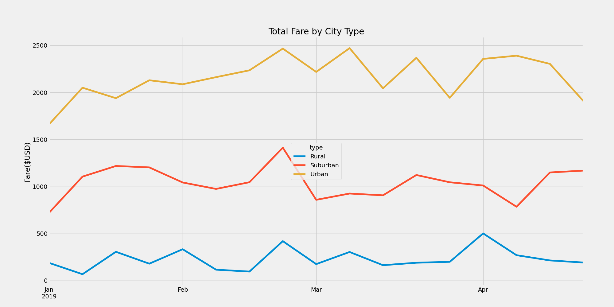

# **Pyber Challenge**
## **Overview:**
The goal of this analysis is to quantity the revenue generated in rural, suburban and urban cities based on the ride sharing data generated for months Jan to April of 2019. The discrepancy between city types is evaluated based on the following:

1.	Driver count
2.	Average fare per ride or per driver
3.	Mean weekly earnings per city type

## **Driver count by city type:**

The number of drivers in the rural areas is a lot lower (78) compared to drivers in suburban areas (625), both of which are a lot lower than in the urban areas (1,625). The numbers are logical as you would expect lower activity in rural areas compared to suburban and urban areas. 

## **Average fare per ride or per driver by city type:**

The average fare per ride is a lot higher for rural areas ($34.62) compared to suburban areas (30.97), both of which are a lot higher than urban areas ($16.57). Based on the number drivers by city type, a rural driver earns $55.49 on an average which is higher than suburban area where a driver earns $39.50 on average. Both of which are a lot higher than urban areas where a driver makes $16.57 on average. These earnings are reflective on the number of drivers present in a particular city type. Rural rides are usually long most people travelling to suburban or urban areas, the cost is higher and since there are not very many drivers, a rural area driver makes a lot more money per ride on average compared to suburban and urban drivers. 

## **Mean weekly earning by city type:**

Though rural area drivers make a lot more money on average per trip, their weekly earnings are a lot lower ($67-$500) compared to a suburban driver who makes ($722-$1413), both of which are a lot lower compared to an urban driver who makes ($1662-$2471). So, the urban driver is at an advantage to make a lot more money per week compared to a suburban or rural driver. 

## **Summary:**

Clearly, the urban city drivers are at an advantage to make more money compared to a rural or a suburban driver. This is the natural order of things governed by the level of activities that goes in areas by city type. One cannot expect to increase the number of rides in rural areas just because it is lower. 

